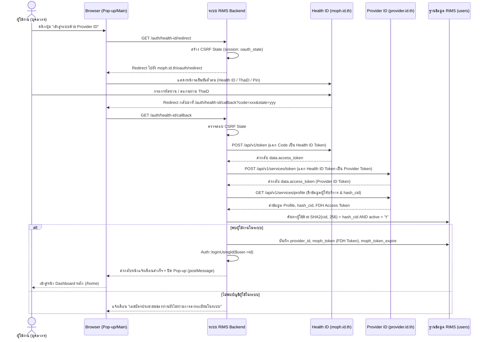

# คู่มือระบบเข้าสู่ระบบด้วย Provider ID / Health ID (MOPH SSO)

คู่มือนี้จัดทำขึ้นเพื่ออธิบายโครงสร้างสถาปัตยกรรม, การตั้งค่าคอนฟิกูเรชัน และขั้นตอนการทำงานของระบบยืนยันตัวตนบุคลากรสาธารณสุขด้วย **Health ID** (`moph.id.th`) และ **Provider ID** (`provider.id.th`) ของกระทรวงสาธารณสุข สำหรับระบบ **H-RiMS**

---

## 1. ข้อมูลการตั้งค่าระบบ (Configurations)

ระบบรองรับการดึงค่า Config ทั้งจากตาราง `main_setting` และเซิร์ฟเวอร์ License กลางผ่าน `App\Services\LicenseVerificationService::getConfig` โดยมีตัวแปรหลัก 6 ตัว:

| ตัวแปรการตั้งค่า | คำอธิบาย | ตัวอย่าง / ค่าเริ่มต้น |
| :--- | :--- | :--- |
| `provider_id_active` | เปิด/ปิดการเข้าสู่ระบบด้วย Provider ID | `'Y'` หรือ `'N'` |
| `health_id_client_id` | Client ID ของระบบ Health ID (MOPH IDP) | ค่าที่ได้รับจาก สป.สธ. |
| `health_id_client_secret` | Client Secret ของระบบ Health ID | ค่าที่ได้รับจาก สป.สธ. |
| `health_id_redirect_uri` | Callback URL ขากลับหลังยืนยันตัวตนสำเร็จ | `https://your-domain/auth/health-id/callback` |
| `provider_id_client_id` | Client ID ของบริการ Provider ID API | ค่าที่ได้รับจาก สป.สธ. |
| `provider_id_secret_key` | Secret Key ของบริการ Provider ID API | ค่าที่ได้รับจาก สป.สธ. |

---

## 2. ขั้นตอนสถาปัตยกรรมการทำงาน (SSO Workflow)



---

## 3. รายละเอียดการทำงานแต่ละขั้นตอน (Code Architecture)

### 3.1 การเริ่มต้นขอสิทธิ์เข้าสู่ระบบ (`redirectToProvider`)
* **Endpoint**: `GET /auth/health-id/redirect` (`route('auth.health-id.redirect')`)
* **Controller**: `App\Http\Controllers\Auth\ProviderIdAuthController@redirectToProvider`
* **การทำงาน**:
  1. ตรวจสอบว่าเปิดใช้งาน `provider_id_active === 'Y'` และมี `health_id_client_id` หรือไม่
  2. สร้างสุ่ม `state` 40 ตัวอักษร เก็บไว้ใน `session('oauth_state')` เพื่อป้องกันการโจมตีแบบ CSRF
  3. Redirect ผู้ใช้งานไปยัง `https://moph.id.th/oauth/redirect`

```php
$query = http_build_query([
    'client_id' => $clientId,
    'redirect_uri' => $redirectUri,
    'response_type' => 'code',
    'state' => $state,
]);

return redirect('https://moph.id.th/oauth/redirect?' . $query);
```

---

### 3.2 การรับข้อมูลขากลับและแลกเปลี่ยน Token (`handleProviderCallback`)
* **Endpoint**: `GET /auth/health-id/callback` (`route('auth.health-id.callback')`)
* **Controller**: `App\Http\Controllers\Auth\ProviderIdAuthController@handleProviderCallback`
* **กระบวนการทำงาน 4 ลำดับ**:

#### 1) แลก Authorization Code เป็น Health ID Token:
```php
$healthIdResponse = Http::withoutVerifying()->asForm()->post('https://moph.id.th/api/v1/token', [
    'grant_type' => 'authorization_code',
    'code' => $code,
    'redirect_uri' => $redirectUri,
    'client_id' => $healthIdClientId,
    'client_secret' => $healthIdClientSecret,
]);
$healthIdToken = $healthIdResponse->json('data.access_token');
```

#### 2) แลก Health ID Token เป็น Provider ID Access Token:
```php
$providerResponse = Http::withoutVerifying()->post('https://provider.id.th/api/v1/services/token', [
    'client_id' => $providerIdClientId,
    'secret_key' => $providerIdSecretKey,
    'token_by' => 'Health ID',
    'token' => $healthIdToken,
]);
$providerToken = $providerResponse->json('data.access_token');
```

#### 3) ดึงประวัติผู้ให้บริการและรหัสบัตรประชาชนที่เข้ารหัส (`hash_cid`):
```php
$profileResponse = Http::withoutVerifying()->withHeaders([
    'Authorization' => 'Bearer ' . $providerToken,
    'client-id' => $providerIdClientId,
    'secret-key' => $providerIdSecretKey,
])->get('https://provider.id.th/api/v1/services/profile', [
    'moph_idp_permission' => 1
]);
$profileData = $profileResponse->json('data');
$hashCid = $profileData['hash_cid'] ?? null;
```

#### 4) จับคู่ผู้ใช้งานในฐานข้อมูล RiMS ด้วย `SHA2(cid, 256)`:
```php
$user = DB::table('users')
    ->whereRaw('SHA2(cid, 256) = ?', [$hashCid])
    ->where('active', 'Y')
    ->first();

if (!$user) {
    return $this->returnAuthResponse(false, 'ไม่พบรายชื่อในระบบ RiMS (CID ยังไม่ลงทะเบียน)');
}

Auth::loginUsingId($user->id);
```

---

## 4. การจัดการ Token FDH สำหรับส่งข้อมูลเคลม (Financial Data Hub)

เมื่อผู้ใช้ล็อกอินผ่าน Provider ID สำเร็จ ระบบจะดึง **MOPH FDH Token** (`moph_access_token_idp_fdh`) ที่ผูกกับรหัสหน่วยบริการของโรงพยาบาล (`hospital_code` / `hcode`) โดยอัตโนมัติ:

1. บันทึกลงใน **Session**: `session(['moph_fdh_token' => $mophFdhToken])`
2. บันทึกลงในตาราง **`users`**:
   - `provider_id`: บันทึกเลขประจำตัวผู้ให้บริการ
   - `moph_token`: บันทึก FDH Token ล่าสุด
   - `moph_token_expire`: ตั้งเวลาหมดอายุ 12 ชั่วโมง (`now()->addHours(12)`)
3. สามารถนำ Token นี้ไปใช้ส่งเคลมหรือดึงข้อมูลผ่าน API ของกระทรวงฯ และ FDH ได้ทันทีโดยไม่ต้องเข้าสู่ระบบซ้ำ

---

## 5. การรองรับหน้าจอ Pop-up Login (Window PostMessage)

ระบบรองรับการเปิดหน้าจอ Login ผ่านหน้าต่าง Pop-up เมื่อกระบวนการยืนยันตัวตนสำเร็จ:
- หน้าต่าง Pop-up จะส่ง `window.opener.postMessage({ status: "success", type: "PROVIDER_ID_AUTH_SUCCESS" }, "*")` ไปยังหน้าหลัก
- หน้าต่าง Pop-up จะปิดตัวเองลงอัตโนมัติภายใน 1 วินาที
- หน้าต่างหลักจะรีเฟรชหรือเปลี่ยนเส้นทางเข้าสู่ระบบทันทีอย่างราบรื่น

---

## 6. ไฟล์ที่เกี่ยวข้องในระบบ

1. **Controller**: [app/Http/Controllers/Auth/ProviderIdAuthController.php](file:///d:/Project%20Laravel/h-rims/app/Http/Controllers/Auth/ProviderIdAuthController.php)
2. **Routes**: [routes/web.php](file:///d:/Project%20Laravel/h-rims/routes/web.php) (กลุ่ม Route `auth.health-id.*`)
3. **View**: [resources/views/auth/login.blade.php](file:///d:/Project%20Laravel/h-rims/resources/views/auth/login.blade.php) (ปุ่มเข้าสู่ระบบด้วย Provider ID)
4. **Service**: [app/Services/LicenseVerificationService.php](file:///d:/Project%20Laravel/h-rims/app/Services/LicenseVerificationService.php) (จัดการดึง Key & License)
5. **คู่มือ 2FA**: [Moph_Alert_2FA.md](file:///d:/Project%20Laravel/h-rims/Moph_Alert_2FA.md) (ระบบ 2FA MOPH Alert)
